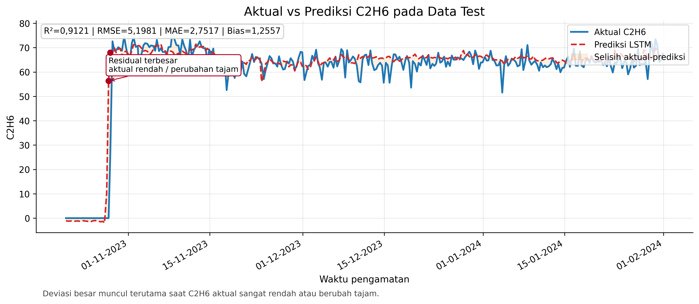
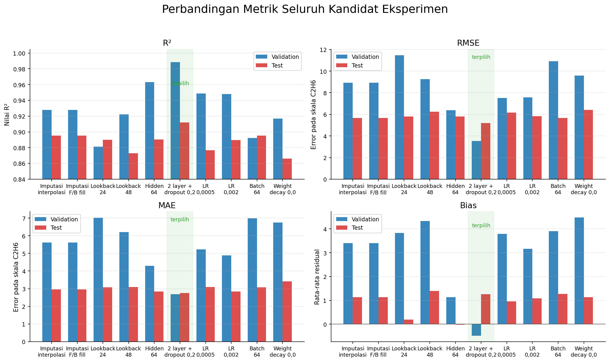
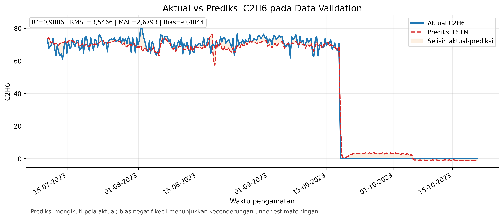
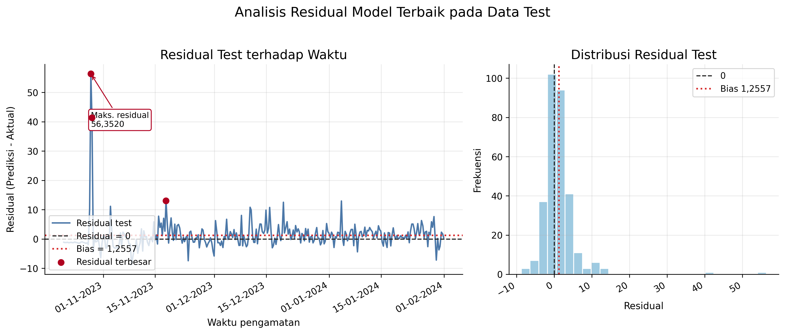

# LSTM Soft Sensor untuk Estimasi Kandungan Etana

Halaman proyek untuk penelitian:

> **Pengembangan _Soft Sensor_ Berbasis LSTM untuk Estimasi Kandungan Etana pada Unit _Deethanizer Column_ di _Plant_ 3 _Train_ G**

Penelitian ini mengembangkan _soft sensor_ berbasis Long Short-Term Memory (LSTM) untuk mengestimasi kandungan etana (C2H6) pada unit _deethanizer_. Model memanfaatkan data historis proses agar estimasi C2H6 dapat dipantau lebih kontinu ketika pembacaan _Gas Chromatograph_ memiliki jeda analisis atau sedang tidak tersedia.

## Ringkasan

| Aspek | Keterangan |
| --- | --- |
| Objek | Unit _Deethanizer Column_ di _Plant_ 3 _Train_ G |
| Target estimasi | Kandungan etana, C2H6 |
| Pendekatan | _Soft sensor_ berbasis LSTM |
| Data | 2.057 observasi historis |
| Periode | 17 Maret 2022 sampai 31 Januari 2024 |
| Masukan model | 13 variabel proses |
| Split data | 70% _train_, 15% _validation_, 15% _test_ secara kronologis |
| Konfigurasi terbaik | LSTM dua layer, _dropout_ 0,2, _hidden size_ 32, _lookback_ 36 timestep |

## Latar belakang

PT Badak LNG Bontang menghadapi perubahan komposisi gas umpan setelah masuknya pasokan gas _lean_ dari Lapangan Merakes. Perubahan ini memengaruhi komposisi hidrokarbon, termasuk etana, sehingga pemantauan C2H6 menjadi penting untuk memahami kondisi operasi _Deethanizer Column_.

_Gas Chromatograph_ tetap menjadi instrumen referensi untuk pengukuran komposisi. Namun, pengukuran tersebut tidak selalu tersedia secara instan karena adanya jeda analisis dan kebutuhan pemeliharaan. Kondisi ini membuka kebutuhan terhadap estimator berbasis data yang dapat memanfaatkan sinyal proses historis untuk memberikan estimasi kandungan etana secara lebih kontinu.

## Tujuan

Tujuan penelitian ini adalah membangun baseline _soft sensor_ LSTM untuk estimasi C2H6 pada _Deethanizer Column Plant 3 Train G_, lalu mengevaluasi kemampuannya dalam mengikuti tren kandungan etana pada data _validation_ dan _test_.

## Metode

Estimasi C2H6 diperlakukan sebagai masalah deret waktu. Data proses dikonversi menjadi _sequence_ menggunakan _sliding window_, lalu dipelajari dengan LSTM agar model dapat menangkap konteks historis sebelum menghasilkan estimasi.

Tahapan utama:

1. Menyusun data historis proses dan target C2H6 secara kronologis.
2. Mengisi celah fitur proses menggunakan interpolasi linear dan _backward/forward fill_.
3. Menjaga nilai target tanpa imputasi.
4. Melakukan split kronologis 70/15/15 untuk _train_, _validation_, dan _test_.
5. Membentuk _sequence_ dengan _sliding window_.
6. Membandingkan kandidat konfigurasi LSTM berdasarkan performa _validation_.
7. Mengevaluasi model terbaik pada data _test_ sebagai periode holdout akhir.

## Hasil utama

Konfigurasi terbaik menggunakan LSTM dua layer dengan _dropout_ 0,2, _hidden size_ 32, dan _lookback_ 36 timestep.

| Metrik data _test_ | Nilai |
| --- | ---: |
| R² | 0,9121 |
| RMSE | 5,1981 |
| MAE | 2,7517 |
| Bias | 1,2557 |

Hasil menunjukkan bahwa LSTM mampu mengikuti tren utama C2H6 pada data uji. Model ini menjanjikan sebagai baseline _soft sensor_ atau alat bantu monitoring, tetapi belum ditujukan sebagai pengganti final _analyzer_ tanpa validasi operasional lebih lanjut.

## Grafik hasil

### Aktual vs prediksi pada data _test_

### Perbandingan metrik kandidat

### Aktual vs prediksi pada data _validation_

### Residual pada data _test_

## Interpretasi

Model menunjukkan kemampuan kuat untuk menangkap pola utama C2H6, terutama pada kondisi operasi yang mengikuti tren historis. Deviasi masih dapat muncul ketika nilai aktual berubah tajam atau berada pada periode yang kurang terwakili oleh data pelatihan. Karena itu, hasil ini lebih tepat diposisikan sebagai dukungan keputusan awal, bukan pengganti final _analyzer_.

## Artefak

- [RTA PDF](site/assets/RTA-443607-Ainul-Yaqin.pdf)
- [Aktual vs prediksi data _test_](site/assets/gambar-5-4-aktual-vs-prediksi-test.png)
- [Perbandingan metrik kandidat](site/assets/gambar-5-2-perbandingan-metrik-kandidat.png)
- [Aktual vs prediksi data _validation_](site/assets/gambar-5-3-aktual-vs-prediksi-validation.png)
- [Residual data _test_](site/assets/gambar-5-6-residual-test.png)
